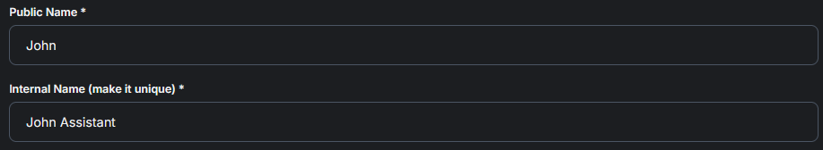

# Agent Info Tab

## Info Tab

The Info Tab is where you'll be able to edit the Exterior of your AI Agent.

<figure><figcaption></figcaption></figure>

## Agent Name Public & Internal.

The **Public Name** is the name users will see when interacting with the AI agent, while the **Internal Name** is used behind the scenes to uniquely identify and manage the agent in your system.

<figure><figcaption></figcaption></figure>

## Description

The descriptions allows those within the Organization to see the purpose of the AI Agent by giving it a description.

<figure><figcaption></figcaption></figure>

## Disclaimer

This serves the purpose of telling the user a disclaimer within the Live Chat before fully interacting.

<figure><figcaption></figcaption></figure>

<figure><figcaption></figcaption></figure>

## Tags

Tagging an AI agent helps categorize and organize it by function or department—like Sales or Support—making it easier to manage, filter, and assign within large teams or systems.

<figure><figcaption></figcaption></figure>

## [Agents Tab Full Showcase](https://www.youtube.com/watch?v=FE4Stzy5fTk)


