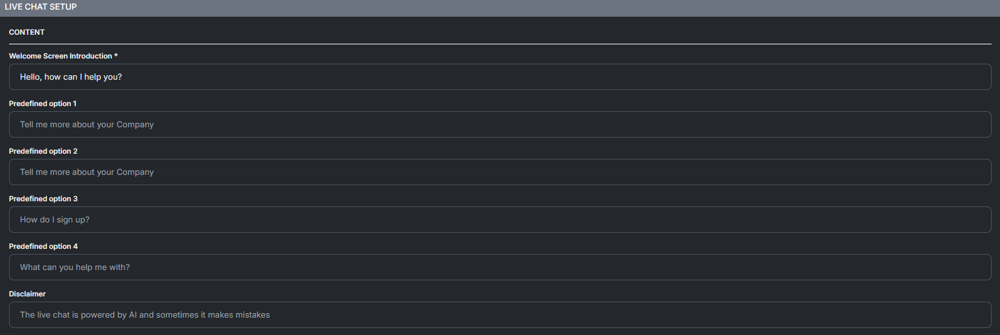
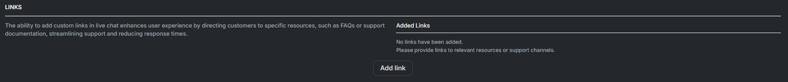
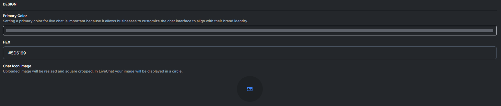

# Live Chat Skill

Setting up the **Live Chat Skill** in raiaAI’s Launch Pad involves a structured configuration process, broken into sections for content, customization, security, and design. Here's a step-by-step guide:&#x20;

***

## Live Chat Skill

The **Live Chat Skill** allows customers to instantly interact with your AI assistant directly from your website. You can fully customize how the chat window greets users, what options are displayed, and the overall look and behavior of the widget.

***

### ✨ Welcome & Predefined Options

<figure><figcaption></figcaption></figure>

These settings determine what users see when they first open the chat.

| Field                           | Description                                                    | Best Practice                                |
| ------------------------------- | -------------------------------------------------------------- | -------------------------------------------- |
| **Welcome Screen Introduction** | The first message displayed to users                           | Keep it friendly and actionable              |
| **Predefined Option 1–4**       | Button prompts users can tap to instantly begin a conversation | Use common FAQs or high-intent questions     |
| **Disclaimer**                  | Displays a notice beneath chat options                         | Inform users that responses are AI-generated |

***

#### Example Configuration

> **Welcome:** “Hi there! How can I help you today?”\
> **Options:**\
> 1️⃣ Tell me more about your company\
> 2️⃣ How do I sign up?\
> 3️⃣ What can you help me with?\
> **Disclaimer:** “This live chat is powered by AI and may occasionally make mistakes.”

***

### 🔗 Links

<figure><figcaption></figcaption></figure>

You can add quick-access links to resources such as:

* FAQs
* Help Center
* Pricing or Signup pages
* Documentation

These appear inside the chat, giving users faster resolutions with fewer messages.

✅ You can add multiple links\
✅ Headers can be added for authenticated webhooks

***

### 🎨 Design Customization

<figure><figcaption></figcaption></figure>

Brand the chat experience to match your product.

| Setting                      | Description                                      |
| ---------------------------- | ------------------------------------------------ |
| **Primary Color / HEX Code** | Sets the accent color throughout the chat UI     |
| **Chat Icon Image**          | Your logo or mascot (auto-cropped into a circle) |

> Tip: Use a high-contrast color to improve button visibility.

***

### ⚙️ Chat Configuration

| Setting                          | Description                                                        |
| -------------------------------- | ------------------------------------------------------------------ |
| **Default Page**                 | Choose what page opens when chat launches (Home, Chat, Voice Chat) |
| **Automatic Open Chat**          | Automatically pops open chat after visitors arrive                 |
| **Auto Open Delay**              | Time delay before opening (seconds)                                |
| **Voice Chat Enabled**           | Enables microphone interaction                                     |
| **Streaming Chat Enabled**       | Messages stream in real-time                                       |
| **Reasoning Label**              | Custom “thinking…” message displayed while AI processes            |
| **Message Length Limit**         | Cap on user message size (default: 3000 chars)                     |
| **Reasoning Details Enabled**    | Display reasoning details to the user (usually OFF for production) |
| **Voice Chat Subtitles Enabled** | Display live subtitles during voice conversations                  |
| **Citation Enabled**             | Show citations for sourced information                             |
| **File Upload Enabled**          | Allow users to upload files in chat                                |
| **Use Current Page Text**        | Sends page context to the AI for smarter responses                 |

***

### 🕔 Operational Hours

Configure when the AI chat is available.

| Option               | Description                                                 |
| -------------------- | ----------------------------------------------------------- |
| **Limit Chat Hours** | Restrict availability by time & days (e.g., business hours) |

> Outside hours → Chat can be disabled or show an offline message.

***

### 🧑‍💻 User Information Rules

| Setting                       | Description                                                   |
| ----------------------------- | ------------------------------------------------------------- |
| **Required User Information** | Ask for contact details before chat begins (e.g. Name, Email) |

> Useful for lead generation or support ticketing workflows.

***

### 🔐 Live Chat Restrictions

<figure><figcaption></figcaption></figure>

The Live Chat Restrictions settings help ensure that only permitted users can access the chat and that you remain compliant with local regulations.

***

#### ✅ IP Whitelist

**Purpose:** Restrict chat access to specific IP addresses for higher security environments.

| Option               | Description                          |
| -------------------- | ------------------------------------ |
| **Enter IP Address** | Add one or more allowed IP addresses |
| **IP Address List**  | Shows all IPs currently whitelisted  |

🔒 Use Cases:

* Internal company-only chat access
* High-security workflows
* Preventing spambots and unwanted traffic

> If no IPs are added, the chat remains accessible to all users globally.

***

#### 🌍 Geographic Restrictions

**Purpose:** Limit chat access to selected countries based on compliance, licensing, or support availability.

| Option                  | Description                                    |
| ----------------------- | ---------------------------------------------- |
| **Restrict by Country** | Select one or more countries to allow or block |

✅ Helps ensure:

* Local regulatory compliance (e.g., GDPR, region-specific laws)
* Proper routing and language handling
* Controlled market access

> Users outside allowed regions will not be able to open or use the live chat.

***

### 🛡️ Security Best Practices

To maintain secure and trustworthy interactions:

| Recommendation                                 | Benefit                                     |
| ---------------------------------------------- | ------------------------------------------- |
| Enable IP restrictions for internal systems    | Prevents unauthorized access                |
| Use geographic filtering when legally required | Avoids compliance violations                |
| Regularly audit allowed IPs and regions        | Keeps the access list up-to-date            |
| Pair with Auditor Skill                        | Adds automated monitoring for risky content |

***

### ✅ Summary of Capabilities

✔ Fully customizable greetings & FAQs\
✔ Real-time voice and text chat options\
✔ Branding via color & icon uploads\
✔ Operational hour controls\
✔ Optional user info collection\
✔ Optional citation & file support\
✔ Web-friendly automation with links

***
