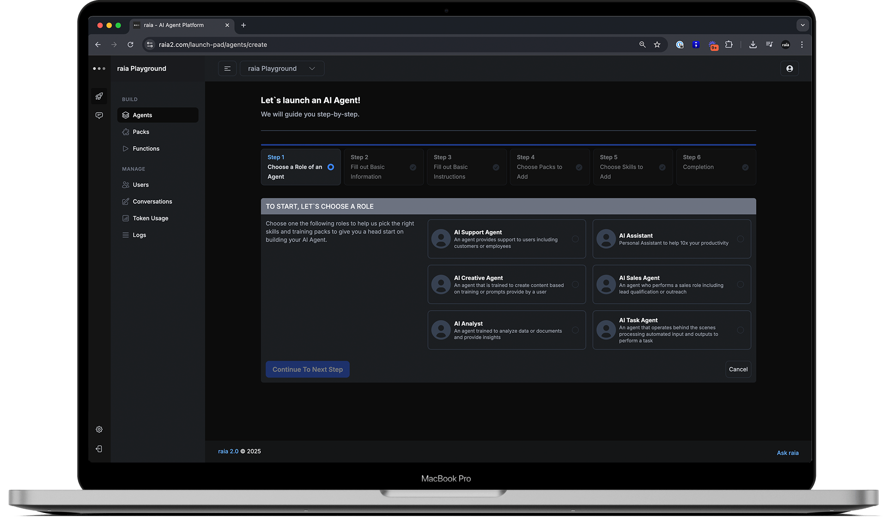

# Command

<figure><figcaption></figcaption></figure>

Meet **raia Command** — the central hub for building, training, and deploying AI agents at scale. Designed for simplicity and speed, raia Command empowers businesses to create intelligent, autonomous agents without a single line of code.&#x20;

Through an intuitive, step-by-step interface, teams can define an agent’s purpose, connect its data sources, assign skills, and launch it into action — all within minutes. Built on a secure, SOC2-compliant infrastructure, raia Command enables organizations to scale from a single use case to hundreds of specialized agents, each trained on company knowledge and processes.&#x20;

Whether you’re automating customer support, sales outreach, or internal workflows, raia Command is your launch control center for building a true digital workforce

### Build an Agent with No Code

Building an AI Agent with Command Pad is fast and intuitive thanks to our step-by-step Wizard. The Wizard walks you through each stage—from selecting a role, to customizing behavior, to launching your agent—using clear, simple prompts.\
\
To make it even easier, you can leverage **pre-built training packs** filled with ready-to-go knowledge and **pre-configured skills** like Chat, SMS, Email, Voice, APIs, and more. Instead of starting from scratch, you simply pick what you need, fine-tune it to your business, and launch your AI Agent in minutes​.

### Simple, Secure and Scalable.

Command makes building and managing AI Agents easy, secure, and scalable. With intuitive setup, built-in security, and conversation monitoring and tracking, you can manage all your agents from a single platform. Centralizing agent management ensures consistent governance, better security, and faster scaling as you build your agentic workforce.

### Empower you AI Agents with Skills

Agents built in Command come with a powerful set of native skills that make them ready for real-world tasks from day one. Every agent can communicate through **Live Chat**, **SMS**, **Email**, and **Voice**, allowing seamless interaction across channels.\
‍\
You can also integrate via **APIs**, trigger **Webhooks**, sync with **Calendars** for scheduling, and connect to **Files** and **Campaigns** for dynamic engagement. These built-in skills make it easy to deploy agents across sales, support, and operations without complex development, giving you immediate versatility and power​.

