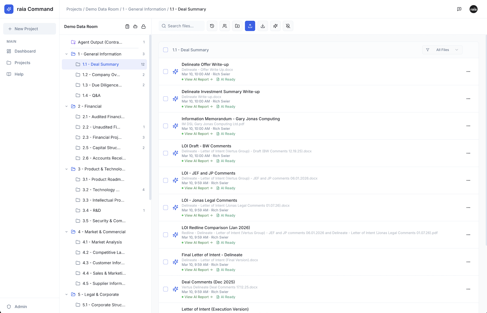

# Command

## Analyzing your Data Room with AI Agentic Workforce

Leverage AI agents to analyze, classify, and extract insights from your data room documents automatically.

<figure><figcaption></figcaption></figure>

***

### Table of Contents

1. Getting Started
2. Projects
3. Data Room
4. AI Features
5. AI Agent Workflows
6. Team & Permissions
7. Settings & Security
8. Setting Up Agents
9. Reports & Activity
10. Supported Files & Limits
11. Application Command Features

***

### Getting Started

_How to sign in, find your way around, and understand the main areas of the app._

**Related routes:** `/auth`, `/dashboard`

#### Signing in

Create an account or sign in with your email. Once you're in, you'll land on the Dashboard — your home base for everything.

* You'll need to verify your email before your first sign-in.
* If your organization uses two-factor authentication, you'll be prompted to complete that step as well.
* Forgot your password? Use the reset link on the sign-in page.

#### Finding your way around

The sidebar on the left is your main menu. From there you can open projects, check reports, manage your team, and access settings.

* Click any project name to jump straight into its data room.
* Use the 'New Project' button at the top of the sidebar to get started quickly.
* On mobile, tap the menu icon to open the sidebar.
* The Help Center (this page) is always available from the sidebar.

#### The Dashboard

The Dashboard gives you a quick snapshot of your workspace — recent projects, key stats, and shortcuts to common actions so you always know where to pick up.

***

### Projects

_Everything about creating, configuring, and managing projects._

**Related routes:** `/projects`, `/projects/new`, `/projects/:id/edit`

#### Creating a new project

Click 'New Project' in the sidebar to get started. Give your project a name, choose a project type, and optionally apply a folder template to set up a ready-made folder structure.

* Folder templates save time by automatically creating commonly used folders (e.g. Financials, Legal, HR).
* You can choose a project type to help categorize your work.
* AI settings like automatic document conversion can be turned on during setup or later.

#### Project overview

When you open a project, the overview page shows you the essentials at a glance — project name, description, team members, and whether AI features like conversion and training are turned on.

* Badges show whether Conversion and Training are set to Automatic or Manual.
* You can see who's on the team and what role they have.
* Quick links take you to the data room, reports, and team settings.

#### Editing project settings

Need to change something? Open the project settings to update the name, description, project type, or AI configuration at any time.

#### Browsing your projects

The Projects page shows all the projects you have access to. Click any project to open its data room, or use the menu to jump to team settings, reports, or activity logs.

***

### Data Room

_Your workspace for uploading, organizing, and working with project documents._

**Related routes:** `/data-room`, `/projects/:id/data-room`, `/document-report`

#### Navigating folders

The folder tree on the left side of the data room lets you browse your project's folder structure. Click a folder to see its files on the right.

* Folders can be nested to create a hierarchy that matches your workflow.
* Double-click a folder name to rename it (admins only).
* Agent Output folders appear at the top of the tree with a distinct icon — one for each AI agent you use. Admins can rename or delete these folders just like any other folder.

#### Uploading files

Drag and drop files into the data room, or use the Upload button to select files from your computer. You can upload individual files or entire ZIP archives.

* ZIP files are automatically extracted so you don't have to unpack them first.
* An upload queue shows progress for each file being uploaded.
* Files are checked for blocked types and size limits before uploading.

#### Smart upload with AI

Use the AI Upload option to let the system automatically classify, title, and sort your documents into the right folders.

* AI reads each document and suggests which folder it belongs in.
* Titles and summaries are generated automatically.
* Large batches are processed in groups so nothing gets missed.

#### Understanding file status

Each file in the list shows a status label so you always know where it stands in the AI pipeline.

* Common statuses: Queued, Converting, AI Ready, Training, Processing.
* If something goes wrong, you'll see a specific error like 'Conversion Failed' rather than a generic message.
* Files that have been fully processed show a 'View AI Report' link.

#### Working with files

Click any file to open its detail panel, where you can view metadata, add notes, download, or take actions like sending it to AI. What you can do depends on your permissions for that project and folder.

***

### AI Features

_How to use AI to convert, train, and process your documents — from setup to results._

**Tags:** AI feature

**Related routes:** `/send-to-ai`, `/ai-settings`, `/ai-queue`, `/ai-report`

#### Setting up AI for your project

Each project has its own AI settings. You can choose between Manual mode (you trigger each action yourself) or Automatic mode (the system handles it for you).

* Automatic Conversion: new uploads are converted to a text format right away.
* Automatic Training: once a file is converted, it's automatically added to the AI knowledge base.
* You can change modes at any time from the project's AI Settings page.
* The project overview shows badges so you can quickly see which modes are active.

#### What are agents?

Agents are the AI services that do the heavy lifting — converting documents, training on your content, and processing files. Your organization can set up multiple agents for different purposes.

* Each agent can be configured for document conversion, training, processing, or a combination.
* One agent can be set as the default for converting documents — new projects will use it automatically.
* When you send documents to an agent, it gets its own output folder in the data room named 'Agent Output (Agent Name)'.
* Agent Output folders can be renamed or deleted by admins, just like regular folders.
* Agents are managed from the Agents page under Integrations.

#### Converting documents

Conversion turns your uploaded files into a text format that AI can work with. This is the first step before training or processing.

* In Manual mode, select files and choose 'Convert' from the Send to AI menu.
* In Automatic mode, files are converted as soon as they're uploaded.
* Converted files show an 'AI Ready' status when they're ready for the next step.
* The conversion agent name is shown in the toast notification and action card so you always know which agent is handling the job.

#### Training AI on your documents

Training uploads your converted documents into an agent's knowledge base, so the AI can search and answer questions about your content.

* Files must be converted before they can be trained.
* In Manual mode, select files and choose 'Train'. If any files haven't been converted yet, they'll be converted first automatically.
* In Automatic mode, training happens as soon as conversion finishes — no action needed from you.

#### Processing documents with AI

Processing sends your documents to an AI agent for tasks like summarization, analysis, or custom workflows. This is the main way to get AI-generated results.

* You can process individual files, selected groups, or entire folders at once.
* Results appear as an AI Report on each file — with options to copy, export to PDF, DOCX, or Excel.
* When multiple files are processed together, a consolidated Batch Report is also available.
* The agent's output is saved in the Agent Output folder for that agent. Admins can rename or delete these folders.

#### Monitoring AI progress

The AI Queue page shows all active and completed jobs so you can track what's happening across your projects.

* See conversion, training, and processing jobs with their current status.
* Failed jobs show specific error messages to help you troubleshoot.
* The AI Report page lets you review results and export them.

***

### AI Agent Workflows

_A detailed look at the three core operations you can perform with AI agents: converting to Markdown, uploading to a vector store, and processing documents._

**Tags:** AI feature

**Related routes:** `/send-to-ai`, `/ai-settings`, `/ai-queue`

#### Converting Documents to Markdown

Conversion is the first step in the AI pipeline. It takes your uploaded files — PDFs, images, Word documents — and turns them into a clean Markdown text format that AI agents can read and work with.

* Manual mode: select one or more files in the data room, open the 'Send to AI' menu, and choose 'Convert to Markdown'.
* Automatic mode: every new upload is converted immediately — no action needed from you.
* The project's conversion agent is chosen in AI Settings. New projects inherit the organization's default conversion agent.
* The agent name is shown in the action card and toast notification so you always know which agent is handling conversion.
* Once conversion is complete, the file status changes to 'AI Ready', meaning it can now be trained or processed.
* If conversion fails, the file shows a 'Conversion Failed' status with details about what went wrong.

#### Uploading to Vector Store (Training)

Training takes your converted documents and uploads them into an AI agent's vector store — a knowledge base the agent can search when answering questions or generating content about your data.

* Files must be converted to Markdown first. If you select unconverted files, they'll be converted automatically before training begins.
* Manual mode: select files and choose 'Upload to Vector Store' from the Send to AI menu.
* Automatic mode: training starts as soon as conversion finishes — fully hands-off.
* The training agent is chosen per project in AI Settings. Only agents with the 'Allow upload of Documents into Vector Store' permission appear as options.
* Training doesn't require a webhook URL — it uses a database-driven queue that agents poll for new work.
* Once training completes, the file's training status updates so you can track progress at a glance.

#### Processing Documents (Send as Prompt)

Processing sends your documents to an AI agent as a prompt — the agent reads the content and returns a response such as a summary, analysis, risk assessment, or any custom output defined by the agent's configuration.

* Select individual files or entire folders, then choose 'Send Documents as Prompt' from the Send to AI menu.
* You can process files one at a time or in batch mode. Batch mode groups files together and sends them as a combined prompt.
* There is a 200,000 character budget per batch. If your documents exceed this, split them into smaller groups.
* Each agent you process with gets its own 'Agent Output' folder in the data room (e.g. 'Agent Output (My Agent)').
* Agent Output folders can be renamed or deleted by admins, just like any other folder.
* Results appear as an AI Report on each file. You can also view a consolidated Batch Report when files are processed together.
* Export results as PDF, DOCX, or Excel from the report view.

***

### Team & Permissions

_How to invite people, assign roles, and control what team members can do._

**Related routes:** `/team`, `/projects/:id/team`, `/invites`

#### Inviting team members

To add someone to a project, go to the project's Team page and send an invite to their email address. Choose a role to define what they'll be able to do.

* Invitees receive a notification and must accept before they gain access.
* You can choose from predefined role templates when inviting, so permissions are set up automatically.
* Pending invites can be reviewed and cancelled from the Invites page.

#### Understanding roles and permissions

Roles define what a team member can do — view files, upload, download, comment, invite others, or manage the project. Permissions can be set at the project level and fine-tuned for specific folders.

* Project admins have full control over the project and its settings.
* Editors can upload and modify files but can't change project settings.
* Viewers have read-only access to files they're allowed to see.
* Folder-level permissions let you restrict or grant access to specific parts of the project.

#### Managing your team

After someone joins, you can update their permissions from the project's Team page. You can also manage organization-wide membership from the Team section in the sidebar.

***

### Settings & Security

_How to manage your account, set up templates, and keep your workspace secure._

**Related routes:** `/settings`, `/security`, `/profile`

#### Folder templates

Folder templates let you save a folder structure that can be reused whenever you create a new project. Set them up once in Settings and apply them with one click during project creation.

* Great for teams that use the same folder structure across deals or engagements.
* You can create multiple templates for different project types.
* Templates can be set as the default so they're automatically suggested for new projects.

#### Account security

Keep your account safe by updating your password and enabling two-factor authentication from the Security page.

* Change your password any time from the Security page.
* Two-factor authentication adds an extra verification step when you sign in.
* Email-based or app-based (TOTP) two-factor options are available.

#### Role templates

Role templates are reusable permission presets that make it easy to onboard new team members with consistent access. Manage them from the Roles tab under Security.

* Define default permissions for common roles like Viewer, Editor, or Admin.
* Apply a template when inviting someone to a project — their permissions are set automatically.
* Update a template to keep future invitations consistent.

#### Profile settings

Update your name, avatar, and email preferences from your Profile page. Your profile information is visible to other members of your organization.

***

### Setting Up Agents

_How to connect and configure AI agents for your organization._

**Tags:** Optional setup

**Related routes:** `/integrations`, `/ai-settings`

#### Adding a new agent

Go to the Agents page (under Integrations in the sidebar) and use the 'Link Agent' tab to connect a new AI service. You'll need the agent's API details to complete setup.

* Give your agent a descriptive name so your team knows what it's for.
* Choose which capabilities to enable: document conversion, training, processing, or any combination.
* Optionally set a webhook URL if the agent needs to send results back automatically.

#### Choosing a default conversion agent

You can mark one agent as the default for document conversion. New projects will automatically use this agent, so your team doesn't have to configure it every time. The agent name is visible to all project members during conversion — it appears in toast notifications and action cards.

#### Assigning agents to projects

Each project can use different agents for conversion and training. Go to a project's AI Settings page to choose which agents it should use.

* New projects start with the organization's default conversion agent.
* You can override this on a per-project basis without affecting other projects.
* When an agent processes files for a project, its results appear in a dedicated 'Agent Output' folder that admins can rename or delete.

***

### Reports & Activity

_How to review AI results, track project activity, and export reports._

**Related routes:** `/project-activity`, `/member-activity`, `/project-report`, `/document-report`, `/ai-report`

#### Viewing AI results

After AI processes a file, open it and click 'View AI Report' to see the generated content. Reports include formatted output with options to copy or export.

* Export reports as PDF, DOCX, or Excel.
* Toggle between formatted and raw views to see exactly what the AI generated.
* Batch Reports consolidate results when multiple files are processed together.

#### Activity logs

The Activity pages show a timeline of what's happened in your projects — who uploaded files, changed settings, or triggered AI actions.

* Project Activity shows everything that happened in a specific project.
* Member Activity lets you see what a specific team member has done across projects.

#### Project reports

Project and Document report pages give you a high-level view of how a project is progressing — file counts, processing status, and overall health.

***

### Supported Files & Limits

_Which files you can upload, which are blocked, and the size limits that apply._

**Related routes:** `/data-room`

#### What you can upload

The platform supports a wide range of common document, image, and data formats.

* Documents: PDF, Word (DOC/DOCX), Excel (XLS/XLSX), PowerPoint (PPT/PPTX), and more.
* Images: PNG, JPG, GIF, WEBP, SVG, BMP, TIFF.
* Data files: JSON, XML, YAML, CSV, TSV, HTML, Markdown.
* Archives: ZIP files — these are automatically extracted when uploaded.

#### What's blocked

For security, certain file types can't be uploaded. These include executable files, scripts, macro-enabled Office documents, system files, and video files.

* Examples: .exe, .bat, .sh, .js, .docm, .xlsm, .mp4, .mov.
* If you try to upload a blocked file type, it will be rejected automatically.

#### Size and batch limits

To keep everything running smoothly, there are limits on file sizes and how many files you can upload at once.

* Maximum file size: 50 MB per file.
* Maximum batch: 100 files per upload.
* ZIP archives: up to 500 MB total, but each file inside is still limited to 50 MB.

#### AI conversion compatibility

Most common formats work with AI conversion, but some file types need an extra step.

* Best for AI: PDF, images (PNG, JPG, GIF, WEBP), and plain text formats (TXT, CSV, JSON, XML, HTML, Markdown).
* Word, Excel, and PowerPoint files should be exported to PDF first for best AI conversion results.

***

### Application Command Features

The application includes a comprehensive set of commands and capabilities across all modules:

#### Project Management

* Create, edit, and delete projects
* Apply folder templates during project creation
* Set project types for categorization
* Configure AI modes (Manual/Automatic) per project
* Archive and restore projects

#### Data Room Operations

* Upload files via drag-and-drop or file picker
* Upload and auto-extract ZIP archives
* AI-powered smart upload with automatic classification and folder sorting
* Create, rename, and delete folders (nested hierarchy supported)
* Move files between folders
* Bulk select files for batch operations
* Download individual files or bulk markdown ZIP exports
* Download entire project as markdown ZIP

#### AI Commands

* **Convert to Markdown** — Transform uploaded documents into AI-readable text
* **Upload to Vector Store (Train)** — Add converted documents to an agent's knowledge base
* **Send Documents as Prompt (Process)** — Send files to an AI agent for analysis/summarization
* **AI Upload** — Classify and auto-sort documents using AI
* **Suggest Folder Structure** — AI-driven folder reorganization suggestions
* Batch processing with 200,000 character budget per batch
* Monitor jobs via AI Queue page

#### File Actions

* View file details (metadata, word count, token estimate, labels)
* Add and edit file notes
* View markdown content
* Export to PDF, DOCX, Excel, or raw Markdown (.md)
* View AI Report per file
* View Batch Report for grouped processing results
* Copy AI response to clipboard

#### Team & Access Control

* Invite members to organizations and projects via email
* Accept or decline pending invitations
* Assign roles: org\_owner, org\_admin, project\_admin, contributor, reader, editor, viewer
* Set project-level permissions (view, upload, download, comment, invite, admin, editor)
* Set folder-level permission overrides
* Apply role templates for consistent onboarding
* Remove organization members

#### Security Commands

* Change password
* Enable/disable email-based MFA
* Set up TOTP (app-based) two-factor authentication
* Configure project security overrides (lock upload, download, comment, invite)

#### Settings & Configuration

* Manage folder templates (create, edit, set default)
* Manage role templates (create, edit, delete)
* Manage project types (create, edit, delete)
* Update profile (name, avatar, timezone)

#### Agent Management

* Link new AI agents with API credentials
* Configure agent capabilities (convert, train, process)
* Set default conversion agent
* Assign conversion and training agents per project
* Set agent context and webhook URLs

#### Reporting

* View AI Reports per document
* View Batch Reports for grouped results
* Project Reports with file stats and processing status
* Document Reports with detailed file metadata
* Project Activity timeline
* Member Activity across projects
* Error logs for debugging

#### Webhook & Integration Commands

* Configure global webhooks
* Set up per-organization webhooks
* Processing notification webhooks

#### Admin Commands

* View and manage conversion queue
* Review user feedback
* Manage global webhooks
* License activation and verification
