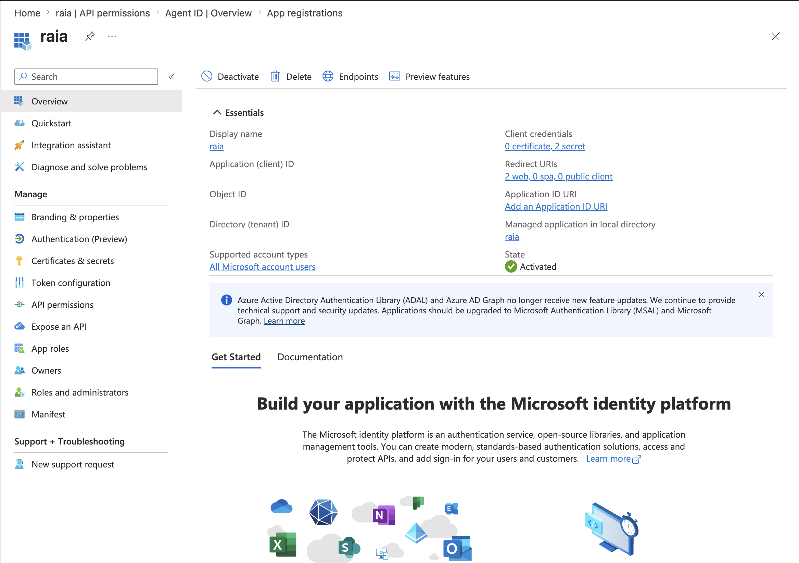
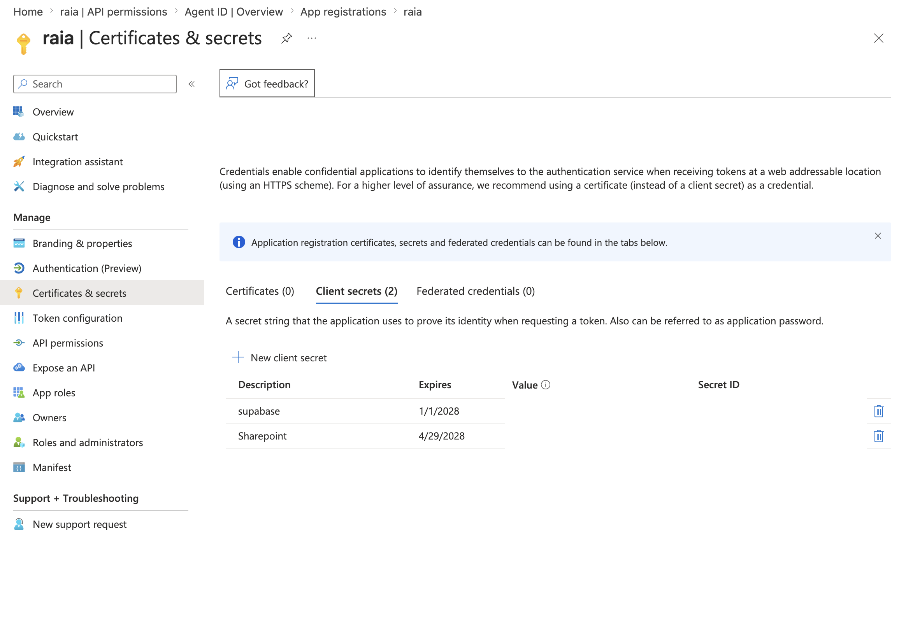
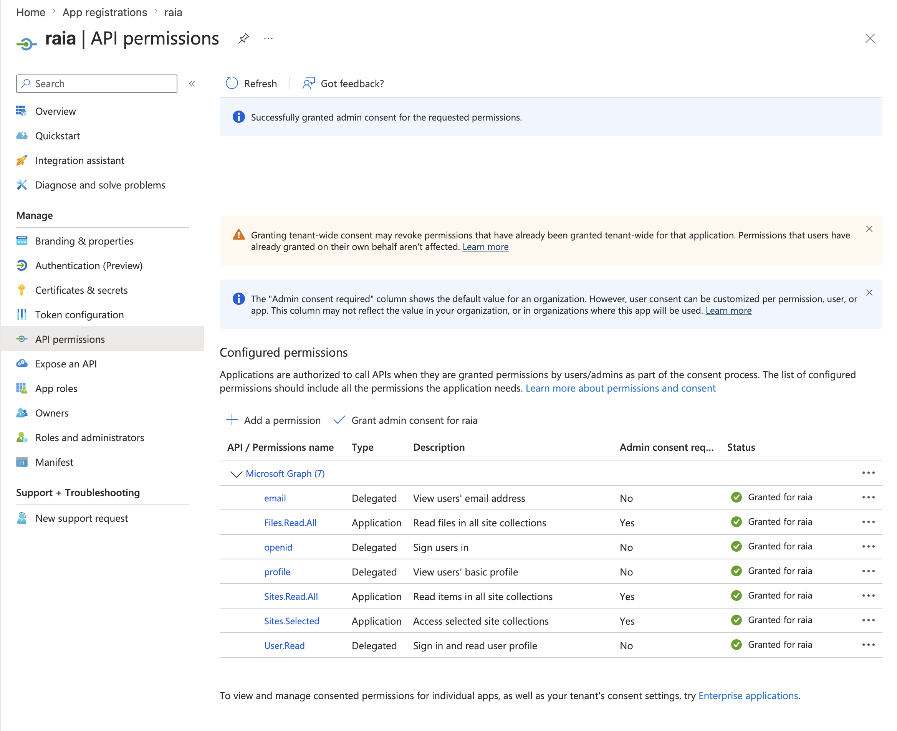

# Microsoft Sharepoint

Use a **Microsoft Entra ID App Registration** with **application permissions** and the **client credentials flow**. This lets your backend or automation access SharePoint without a user logging in.

For security, prefer:

```
Microsoft Graph → Application permission → Sites.Selected
```

Then grant that app access only to the SharePoint site(s) it needs. `Sites.Selected` is Microsoft’s scoped permission model for giving an app access to specific SharePoint site collections instead of the whole tenant. ([Microsoft Learn](https://learn.microsoft.com/en-us/graph/permissions-selected-overview?utm_source=chatgpt.com))

Avoid tenant-wide permissions like `Files.ReadWrite.All` or `Sites.ReadWrite.All` unless you truly want the app to read/write across all SharePoint sites.

***

## 1. Create the Entra ID app registration

In Microsoft 365 admin / Azure portal:

1. Go to **Microsoft Entra admin center**
2. Open **Identity → Applications → App registrations**
3. Click **New registration**
4. Name it something like:

```
SharePoint API File Manager
```

5. Supported account type:

```
Accounts in this organizational directory only
```

6. Click **Register**
7. Copy these values:
   * **Application / Client ID**
   * **Directory / Tenant ID**

Microsoft’s client credentials flow is designed for service-to-service access where the app authenticates with its own credentials rather than as a signed-in user. ([Microsoft Learn](https://learn.microsoft.com/en-us/entra/identity-platform/v2-oauth2-client-creds-grant-flow?utm_source=chatgpt.com))

<figure><figcaption></figcaption></figure>


***

## 2. Create a client secret or certificate

In the app registration:

1. Go to **Certificates & secrets**
2. Prefer **Certificates** for production
3. For quick setup, use **Client secrets → New client secret**
4. Set an expiration
5. Copy the secret value immediately

You will need:

```
TENANT_ID
CLIENT_ID
CLIENT_SECRET
CLIENT_SECRET_ID
```

For production, store the secret in a vault, not in code or environment files committed to source control.

<figure><figcaption></figcaption></figure>


***

## 3. Add Microsoft Graph API permissions

In the app registration:

1. Go to **API permissions**
2. Click **Add a permission**
3. Choose **Microsoft Graph**
4. Choose **Application permissions**
5. Add:

```
Sites.Selected
```

6. Click **Grant admin consent**

Important: `Sites.Selected` alone does **not** give access to any site. It only allows the app to be granted access to specific sites. You must do the site-level grant next. Microsoft describes `Sites.Selected` as managing application access at the site collection level. ([Microsoft Learn](https://learn.microsoft.com/en-us/graph/permissions-selected-overview?utm_source=chatgpt.com))

<figure><figcaption></figcaption></figure>


***

## 4. Get the SharePoint site ID

Use Microsoft Graph to resolve the SharePoint site.

Example site URL:

```
https://contoso.sharepoint.com/sites/Operations
```


***


## Minimum permission recommendation

Use this for production:

```
Microsoft Graph Application Permission:
- Sites.Selected

Then grant site-specific role:
- write
```

Only use these broader permissions when necessary:

```
Files.ReadWrite.All
Sites.ReadWrite.All
```

Those are easier to configure but much riskier because they can allow broad tenant-wide SharePoint/OneDrive access.

***
