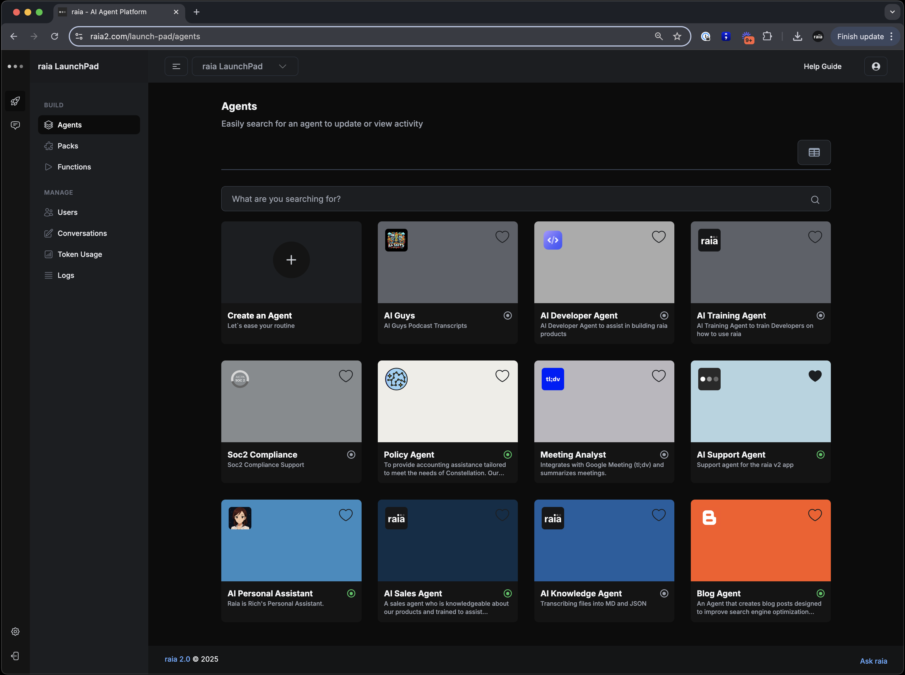

# What is raia?

**Welcome to raia**—the platform that helps you build your AI-powered workforce, all in one place. With raia, you can create and manage AI agents that are trained on your data, follow your processes, and support your team—without needing any technical skills. Everything happens on a single, secure, and scalable platform, so you can grow your agentic workforce with confidence, one use case at a time.

<figure><figcaption></figcaption></figure>

## What is raia?&#x20;

**raia**  is an advanced multi-agent platform that allows organizations to create and manage specialized AI Agents, each with distinct roles, skills, and knowledge packs. Roles define tasks, while skills handle communication channels, such as SMS, email, or live chat. Packs supply training data and instructions to accelerate agent creation.&#x20;

The platform includes user access levels, bridging organizational, agent-level, and super-admin controls. There's also an integrated wizard for guiding agent setup, from basic info to packs and skill configuration. With raia v2, businesses can quickly deploy AI-driven solutions tailored to their workflows, providing dynamic, flexible, and scalable agentic capabilities.

<figure><figcaption></figcaption></figure>

## Features

The **top 5 core pillars** of the raia system—especially when viewed through the lens of security, simplicity, scalability, and operational excellence—can be summarized as follows:

***

#### 1. **Security-First Infrastructure**

* **SOC2-compliant architecture** with **enterprise-grade access controls**, audit trails, and encryption standards ensures secure handling of data across the platform.
* Every agent interaction is **audited and logged**, and security extends to **API integrations**, **data storage**, and **user management**.

***

#### 2. **Simplicity via No-Code Agent Creation**

* The **Launch Pad** enables users to **build AI agents without coding**, using a step-by-step Wizard and pre-built templates.
* This lowers the technical barrier for SMBs and allows rapid deployment of agents tailored to business roles like Sales, Support, or HR.

***

#### 3. **Scalability through Modular Design and Skills Framework**

* raia’s architecture supports **thousands of agents**, each with modular **skills** like SMS, Email, Chat, Calendar, API integration, and Webhooks.
* Skills and functions are reusable, and agents can operate autonomously across channels, making the system scalable across departments and organizations.

***

#### 4. **Human-in-the-Loop & Feedback Systems**

* **CoPilot** enables **real-time human oversight** of AI agents. Users can take over conversations, edit responses, rate interactions, and improve training data—creating a closed feedback loop for continuous improvement.
* Human-in-the-loop is key for governance, safety, and ensuring quality responses in edge cases.

***

#### 5. **Integration and Workflow Automation**

* raia offers **deep API integration**, webhook support, and native automation workflows, allowing AI agents to interact directly with existing systems like CRMs, calendars, or email platforms.
* This transforms agents from static responders into **workflow participants** that can trigger or execute multi-step processes.

***

These five pillars underpin raia’s ability to serve mid-market companies with high security needs and limited technical teams, providing a platform that is **safe**, **simple**, **scalable**, and **deeply integrated into real-world workflows**.

## How businesses use raia

Raia enables businesses to build an “agentic workforce” by providing an easy-to-use platform where AI Agents, each with a specialized role and skill set, can be quickly created, trained, and deployed. Through a structured wizard, users define the Agent’s purpose, load relevant training data from reusable Packs, and configure various communication channels (Skills) like email, SMS, or live chat.&#x20;

User role and permission settings ensure that each AI Agent stays aligned with the organization’s goals, while integrated monitoring and reporting tools offer real-time insights. As a result, companies can streamline operations, expand service capabilities, and rapidly scale AI-driven solutions across their workforce.
