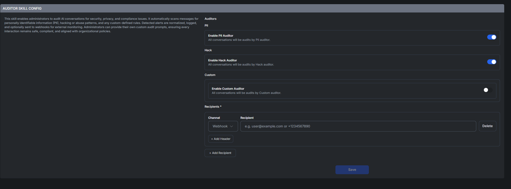
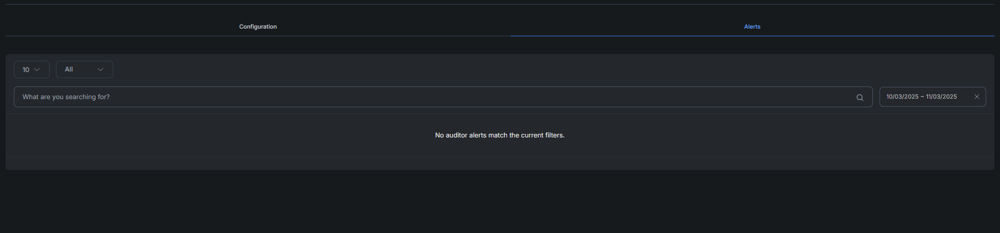

# Auditor Skill

The **Auditor Skill** enables administrators to audit AI conversations for **security, privacy, and compliance** purposes. It automatically scans messages for:

* Personally Identifiable Information (PII)
* Hacking, system abuse, or malicious intent
* Custom organization-defined compliance rules

Detected alerts are **normalized, logged**, and can be **sent to external monitoring systems via webhook**. Admins can also define custom prompts to ensure conversations remain aligned with internal policies.

### 🛡️ Configuration Overview

<figure><figcaption></figcaption></figure>

The Auditor Skill configuration is broken into two parts:

1. **Auditors** — which audit systems are active
2. **Recipients** — who gets notified when alerts occur

***

### 🕵️ PII Auditor (Optional)

**Purpose:** Scans messages for personal identifiers such as emails, phone numbers, and sensitive user data.

**How to Enable:**

* Toggle **Enable PII Auditor**

> Recommended as a core safeguard against data leakage.

***

### 💻 Hack Auditor (Optional)

**Purpose:** Detects hacking patterns, exploitation attempts, and abusive behaviors.

**How to Enable:**

* Toggle **Enable Hack Auditor**

> Helps protect the system from misuse or malicious intent.

***

### ✍️ Custom Auditor (Optional)

**Purpose:** Enforce organization-specific policies using custom rules, keywords, or prompts.

**How to Enable:**

* Toggle **Enable Custom Auditor**
* Configure custom audit criteria

> Ideal for regulatory, compliance, or industry-specific monitoring.

***

### 📬 Recipients (Required)

**Purpose:** Defines where auditor alerts are delivered.

**How to Configure:**

1. Select a **Channel** (e.g., Webhook)
2. Enter the **Recipient Endpoint** (URL, email, etc.)
3. Optionally **+ Add Header** for authorization or metadata
4. Click **+ Add Recipient** to send alerts to multiple destinations

✅ _At least one recipient must be configured for alerts to be dispatched._

***

### 📊 Alerts View

<figure><figcaption></figcaption></figure>

The **Alerts** tab provides centralized monitoring of triggered audit events.

Features:

* **Search & Filter** by:
  * Auditor type (PII, Hack, Custom)
  * Date range
* **Alerts List**
  * Displays alerts matching current filters
  * Shows: _“No auditor alerts match the current filters”_ if none found

***

### ✅ Best Practices

* **Start with PII Auditor**\
  Default safeguard for user data protection
* **Use Webhooks for Automation**\
  Easily integrate with Slack, Splunk, SIEM tools, etc.
* **Grow Custom Rules Over Time**\
  Begin with high-priority compliance requirements
* **Review Alerts Regularly**\
  Refine filters and accuracy as patterns emerge
