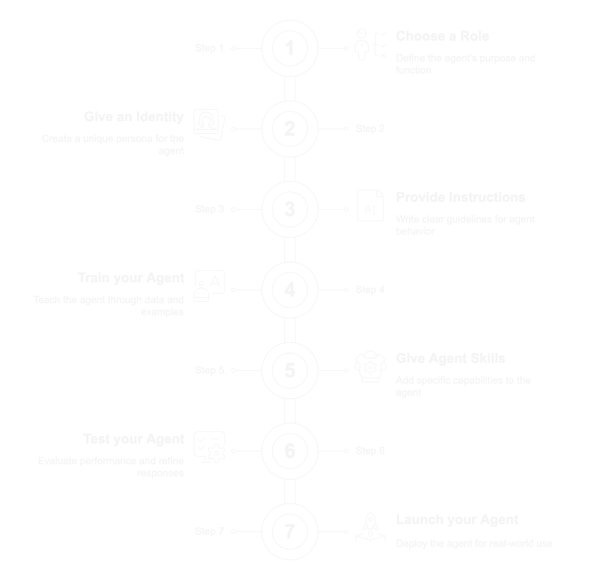

# Launching an AI Agent


### Check out our AI Training Program

For a more comprehensive training program on AI and how to build AI Agents [check out our AI Training](https://app.gitbook.com/o/6fIasulwAMiCXfnCAZn0/s/SfECtcNwrIDQm7NrCIeB/).&#x20;


### Creating an AI Agent is a 7 step process

<figure><figcaption></figcaption></figure>

raia’s Wizard-Based Setup transforms the typically complex process of AI Agent creation into an accessible, user-friendly experience. By guiding teams through each step—defining roles, uploading instructions, assigning training packs, and configuring skills—this streamlined approach ensures every agent is built with precision and clarity. With intuitive, phased prompts and smart defaults, organizations can rapidly spin up new agents while maintaining consistency, governance, and quality across their entire AI workforce.

<figure><figcaption></figcaption></figure>

1. **Guided, Step-by-Step Process**
   * **Clear Progression:** raia’s Wizard offers a structured approach, walking users through each phase of agent creation—from defining the agent’s role to configuring advanced skills. A visible progress bar ensures teams know exactly how far they’ve come and what remains.
   * **Reduced Complexity:** By breaking the setup into smaller tasks, the Wizard keeps configuration approachable, even for non-technical staff. Users can confidently move through each stage without feeling overwhelmed by every option at once.
2. **Key Stages in the Wizard Flow**
   1. **Role Selection:** Pick from available or custom-defined roles (e.g., Sales, Support, Creative) that guide the agent’s overall objectives and behavior.
   2. **Basic Information:** Enter essential details like internal and public-facing names, descriptions, or tags. Users can also upload an image for quick recognition.
   3. **Instructions & Documents:** Provide text-based instructions, upload files, or link to relevant sources. The Wizard can even optimize these instructions with AI, refining grammar or tone automatically.
   4. **Packs Assignment:** Choose from pre-built or custom Packs that supply domain-specific knowledge, quickly equipping the agent with relevant data and policies.
   5. **Skills Configuration:** Add communication channels (SMS, email, live chat) or integration skills (webhooks, API calls). Each skill is easily set up with intuitive prompts for credentials or settings.
   6. **Overview & Launch:** A final summary collects all choices for review. Users can spot-check details and either return to previous steps for edits or finalize the agent launch.
3. **Accelerated Time to Deployment**
   * **Reduced Setup Overhead:** Because the Wizard abstracts away technical complexities—like API integration, advanced prompts, and openAI configurations—teams can deploy agents faster than traditional manual methods.
   * **Smart Defaults & Templates:** Many steps come pre-populated with sensible defaults or optional templates, cutting down on repetitive input. Once set, these defaults can be tweaked if needed, giving both beginners and power users a convenient starting point.
4. **Collaboration & Compliance**
   * **Simplified Hand-Offs:** The Wizard’s clear phases make it easy for different stakeholders to contribute their expertise. For instance, a subject-matter expert can handle instructions, while a developer configures skills.
   * **Consistent Governance:** Automated checks ensure vital fields are filled and compliance guidelines are met before the agent can be activated. This fosters a best-practices culture where no detail slips through the cracks.
5. **Scalability for Multiple Agents**
   * **Cloning & Reuse:** With each new agent, teams can quickly replicate successful setups or tweak settings for specific needs—an especially valuable asset when managing multiple agents across various departments.
   * **Ongoing Updates:** Even post-launch, the Wizard-like interface makes it simple to revisit and update agent configurations, ensuring AI remains accurate and up-to-date as organizational needs evolve.

In short, Raia’s Wizard-Based Setup streamlines AI Agent creation into an intuitive, guided journey. By pairing role-driven clarity with reusable packs and ready-to-configure skills, the Wizard drastically shortens the time from concept to deployment, empowering organizations to expand their AI initiatives with minimal fuss.
