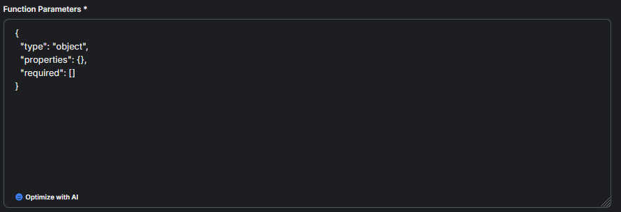

# Launchpad Functions

## Function Tab

<figure><figcaption></figcaption></figure>

## Function Creation

<figure><figcaption></figcaption></figure>

## Function Name & Internal Name

The Function Name provides a clear, user-friendly label for what the AI function does, while the Internal Function Name ensures it’s uniquely identifiable and properly referenced within the system.

<figure><figcaption></figcaption></figure>

## Function Status

Function Status is important because it controls access, allowing you to keep a function private for personal use or share it with your organization for broader collaboration and consistency.

<figure><figcaption></figcaption></figure>

## Function Instructions

Function instructions are essential because they clearly define what the AI should do, ensuring the function is executed accurately and aligned with its intended purpose.

<figure><figcaption></figcaption></figure>

## Webhook to Call

In function creation, the "Webhook to Call" field specifies the external endpoint the AI should contact to execute the function, allowing it to fetch or send data dynamically based on user input or task requirements.

<figure><figcaption></figcaption></figure>

## Function Parameters

Function parameters define the specific inputs an AI function needs to execute properly, such as user-provided data or context values. Structuring these parameters clearly ensures the AI knows what information to collect, validate, and send to the webhook for accurate and efficient task completion.

<figure><figcaption></figcaption></figure>

## Header Name & Value

Header name and value are essential in function creation for securely passing authentication credentials or custom metadata required by the external API being called.

<figure><figcaption></figcaption></figure>
