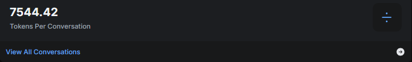
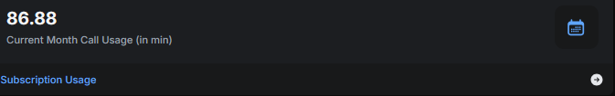
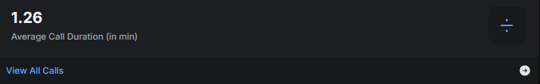

# Launchpad Resource Usage Tab

## Resources Usage

The Resource Usage tabs allows you to keep track of your organizations ENTIRE total usage.

<figure><figcaption></figcaption></figure>

## Monthly Token Limit

The monthly token limit refers to the maximum number of tokens (pieces of text used for processing and generating responses) that can be used within a month for a given subscription plan.

<figure><figcaption></figcaption></figure>

## Total Token Usage

Total Token Usage shows how many tokens you have used out of the Monthly Token Limit, which represents the amount of text processed and generated by the AI so far this month.

<figure><figcaption></figcaption></figure>

## Monthly Call Limit

The monthly call limit indicates the maximum number of minutes the AI can be used for voice or API calls within a month, based on your subscription plan.

<figure><figcaption></figcaption></figure>

## Current Month Token Usage

The current month token usage shows how many tokens the AI has processed and generated so far during this billing cycle.

<figure><figcaption></figcaption></figure>

## Tokens Per Conversation

Tokens per conversation indicates the average number of tokens the AI uses in each interaction, including both user input and AI responses.

<figure><figcaption></figcaption></figure>

## Current Month Call Usage

The current month call usage shows how many minutes of AI voice or API call time have been used so far during the ongoing billing cycle.

<figure><figcaption></figcaption></figure>

## Average Call Duration

The average call duration indicates the typical length of each AI voice or API call, measured in minutes, based on recent usage data.

<figure><figcaption></figcaption></figure>

