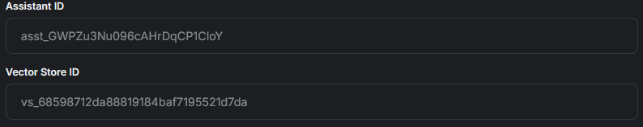

# Agent Training Tab

## Agent Instructions Tab

The Agent Instructions Tab is where you'll be able to edit the prompting and the AI Agents Information

<figure><figcaption></figcaption></figure>

## Ability to go to previous Agent version.

Whenever you save your prompting a version is uploaded and saved as a backup to return to.

<figure><figcaption></figcaption></figure>

## Custom Agent Prompting & Optimization

You are able to create your own Agent prompting and customize it as you wish.

<figure><figcaption></figcaption></figure>

&#x20;If you are less experienced and feel unsure raia AI can optimize it for you. By simply clicking on the Optimize with AI button.

<figure><figcaption></figcaption></figure>

Doing so will optimize your prompting to what is the standard for AI Prompting, even after doing so you are free to edit it as you need.

## Ability to Add Packs

With raia even after the creation of the agent, you are still able to add Information Packs.

<figure><figcaption></figcaption></figure>

## Ability to add documents & disable them as needed.

With raia you have the ability to uploads documents as you please, ranging from Json, Pdfs, etc.

<figure><figcaption></figcaption></figure>

As well as you have the ability to disable and enable as you please after importing them and if needed deleting them.

<figure><figcaption></figcaption></figure>

## Advanced Settings

This tab allows you to fine-tune your AI agent’s behavior by adjusting model settings like creativity (Temperature), response diversity (Top\_P), and enabling features like file search, JSON output, or code interpretation. It also links the agent to a specific Assistant ID and Vector Store for personalized memory and file-driven responses.

<figure><figcaption></figcaption></figure>

## GPT Model

The GPT model you choose determines the intelligence, speed, cost, and capabilities of your AI agent, directly affecting how well it understands and responds to users. Selecting the right model—whether lightweight for efficiency or advanced for complex reasoning—ensures the agent aligns with your specific goals and performance needs.

<figure><figcaption></figcaption></figure>

## AI Agent Creativity

The Creativity (Temperature) setting controls how random or creative the AI’s responses are—lower values (0.2–0.5) produce more focused, predictable answers, while higher values (0.7–1.0) generate more diverse and imaginative output. Adjusting this lets you tailor the AI's tone and response style to match your use case, from technical accuracy to conversational flair.

<figure><figcaption></figcaption></figure>

## AI Agent Randomness

Top\_P, or nucleus sampling, controls how many of the most likely words the AI considers when generating a response—lower values (0.1–0.5) keep outputs focused and structured, while higher values (0.7–1.0) allow for more open-ended and varied responses. Adjusting Top\_P helps balance precision versus creativity based on your AI agent’s intended role.

<figure><figcaption></figcaption></figure>

## AI Agent Functionality

These settings allow you to enhance the AI agent's functionality: **Use File Search** lets the agent retrieve information from uploaded documents, **Output JSON** enables responses in a structured data format, and **Code Interpreter** (when enabled) allows the AI to perform calculations, data analysis, or code-related tasks. Toggling these options customizes how the AI processes and delivers responses based on your use case.

<figure><figcaption></figcaption></figure>

## Assistant ID & Vector Store ID

The **Assistant ID** uniquely identifies a specific AI agent configuration, linking it to its custom instructions, capabilities, and behavior. The **Vector Store ID** connects the agent to a vector database where embedded knowledge from documents is stored, enabling the AI to retrieve relevant information during conversations.

<figure><figcaption></figcaption></figure>

## [Agents Tab Full Showcase](https://www.youtube.com/watch?v=FE4Stzy5fTk)


