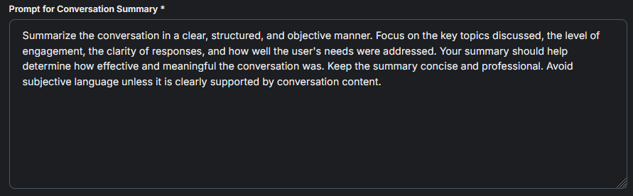

# Agent Scoring Skill

<figure><figcaption></figcaption></figure>

## Ability to customize Scoring Prompt

The Conversation Scoring Skill allows the AI to rate interactions based on engagement and effectiveness, helping identify quality levels and areas for improvement through a standardized scoring system.

<figure><figcaption></figcaption></figure>

## Ability to customize Conversation Summary Prompt

This prompt guides the AI to generate a clear, objective summary of a conversation by highlighting key topics, engagement level, response clarity, and how well the user's needs were met.

<figure><figcaption></figcaption></figure>

## [Agent Scoring Skill Video Tutorial](https://www.youtube.com/watch?v=qj-quHneNlg)


