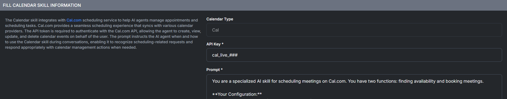

# Agent Scraper Skill

<figure><figcaption></figcaption></figure>

## Able to setup multiple Scrapers

You have the ability to have multiple scrapers for your AI Agent to scrape information from.

<figure><figcaption></figcaption></figure>

## Able to fully customize your agents Scrap Config

You have the ability to fully choose and customize your scraping presets.

<figure><figcaption></figcaption></figure>

### Crawler Type

Selecting the appropriate crawler type determines how your AI or automation tool navigates and extracts data from websites, impacting speed, accuracy, and compatibility. Different crawlers like Apify or Firecrawl offer varying capabilities for structured data extraction, handling dynamic content, authentication, or large-scale scraping tasks. Choosing the right one ensures reliable data collection while minimizing errors, load issues, or website blocking.

<figure><figcaption></figcaption></figure>

## Crawl Format

The crawl format determines how scraped website data is structured and delivered—such as in Markdown for readability, JSON for structured processing, or HTML for raw page content. Choosing the right format ensures the data is usable for your specific needs, whether it's for analysis, display, or integration into other systems.

<figure><figcaption></figcaption></figure>

## Page Limit and Max Depth

Page Limit and Max Depth are key settings in web scraping that help control the scope and efficiency of a crawl. **Page Limit** restricts the total number of pages scraped, preventing overload or unnecessary data collection, while **Max Depth** controls how far the crawler follows links from the starting page, ensuring it doesn't go too deep into irrelevant or unrelated content.

<figure><figcaption></figcaption></figure>

## Scraping Frequency

Defines how often the web scraping process runs for a given website. You can set it to manual (run only when triggered), daily, weekly, or monthly, depending on how often the site’s content changes. Choosing the right frequency ensures you capture updates without overloading the crawler or collecting unnecessary duplicate data.

<figure><figcaption></figcaption></figure>

## Auto Upload Document

When enabled, this feature automatically sends the scraped content to the assistant as a document as soon as the scraping process finishes. This ensures the data is instantly available for review, processing, or further actions without requiring a manual upload.

<figure><figcaption></figcaption></figure>

## Website Exclusion while scraping

Excluding specific URLs during web scraping is important to avoid collecting irrelevant, sensitive, or duplicate content, helping ensure cleaner and more targeted data. It also reduces load on the crawler, speeds up the scraping process, and minimizes the risk of violating site policies or scraping restricted areas.

<figure><figcaption></figcaption></figure>
