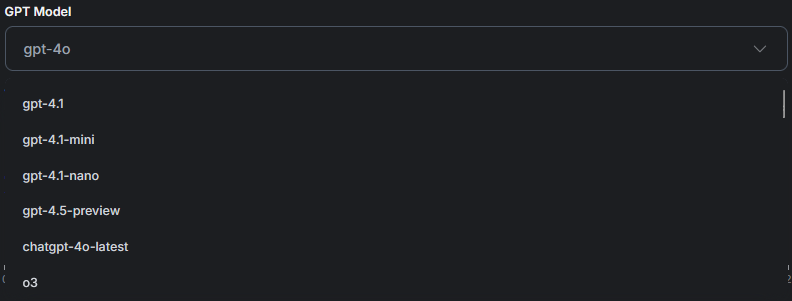

# Agent Voice Skill

## You have the ability to fully customize the Voice Skill to your liking and needs.

This customization panel is important because it allows you to tailor the AI voice assistant's personality, tone, and behavior to match your brand or use case. By adjusting settings like name, greeting, voice, system prompt, model, and creativity level, you ensure the assistant delivers consistent and effective user experiences.

<figure><figcaption></figcaption></figure>

## First Introduction Message

The first introduction message is crucial because it sets the tone for the entire interaction, establishing trust and clarity from the start. It helps users understand who the AI is, what it can do, and encourages engagement by making the experience feel welcoming and purposeful.

<figure><figcaption></figcaption></figure>

## Voice System Prompting

Voice system prompting is important because it defines how the AI assistant behaves, responds, and interacts during voice conversations, ensuring it stays on-brand and aligned with your goals. It provides the AI with clear guidance on tone, boundaries, and purpose, leading to more accurate, natural, and consistent voice interactions.

<figure><figcaption></figcaption></figure>

## Able to choose multiple GPT Models

Having multiple GPT model options for a voice AI allows you to tailor performance, cost, and speed based on your specific use case—whether you need lightweight, fast responses or deeper, more nuanced conversations. It also gives you flexibility to experiment and upgrade as new models become available, ensuring your AI stays both efficient and cutting-edge.

<figure><figcaption></figcaption></figure>

## Voice Selection and Testing

Having multiple voice options lets you match the AI’s tone, personality, and audience preferences—whether you want it to sound friendly, professional, or energetic. The ability to test voices directly on the website ensures you choose the most natural and engaging voice experience before going live.

<figure><figcaption></figcaption></figure>

## Voice Creative Temperature

The creativity temperature is important for a voice AI because it controls how predictable or imaginative the AI’s responses are, allowing you to fine-tune its tone and behavior. Lower temperatures make the AI more focused and consistent ideal for support or technical use while higher temperatures add personality and spontaneity, perfect for conversational or creative roles.

<figure><figcaption></figcaption></figure>

## Max Tokens Allocated

Max Tokens defines the maximum length of the AI's response, with each token representing roughly a word or character chunk. For voice AI, setting a token limit ensures responses stay concise and natural-sounding, avoiding overly long or complex replies in spoken interactions.

<figure><figcaption></figcaption></figure>

## [Voice Setup Video](https://www.youtube.com/watch?v=tGuTksvgUFI)


