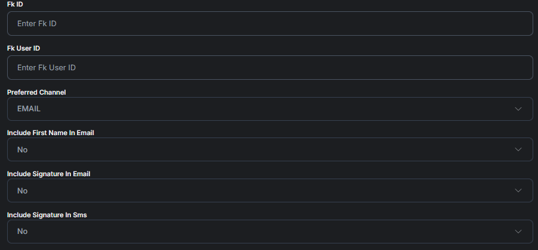

# LaunchPad Users (Basic Information)

## Basic User Information

In Basic User Information you'll find **Date Created, First Name, Last Name, User ID, Email, Phone Number and IP Address.**

<figure><figcaption></figcaption></figure>

Scrolling further down you will see how the AI reached out to the User. What Context the AI Used and through what Source.

<figure><figcaption></figcaption></figure>

This section in basic user information allows you to define key user identifiers (like Fk ID and Fk User ID), set the user's preferred communication channel (such as email or SMS), and customize message content by including their first name or a signature. These preferences help personalize and route communications more effectively, ensuring messages are delivered in the most appropriate format for the user.

<figure><figcaption></figcaption></figure>
